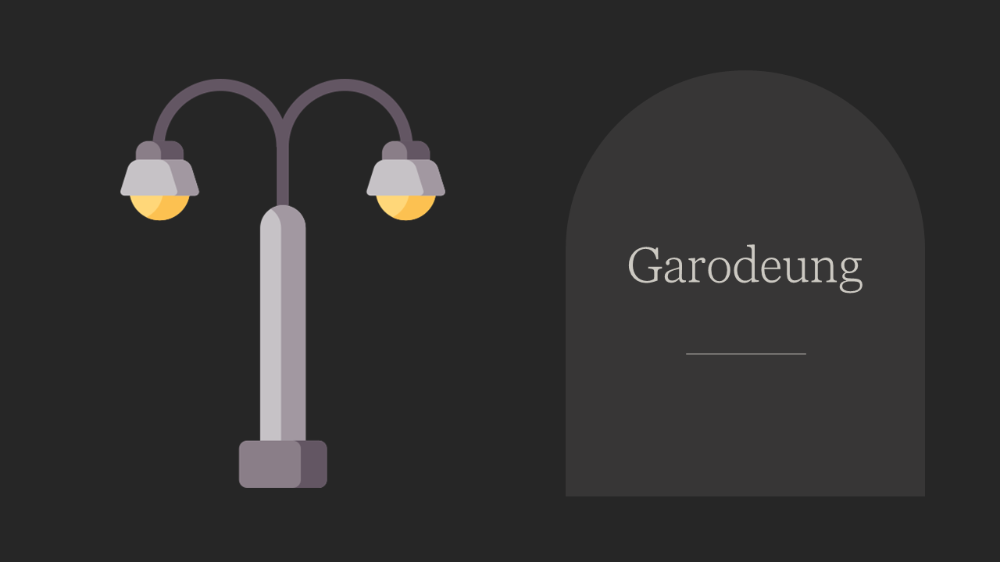
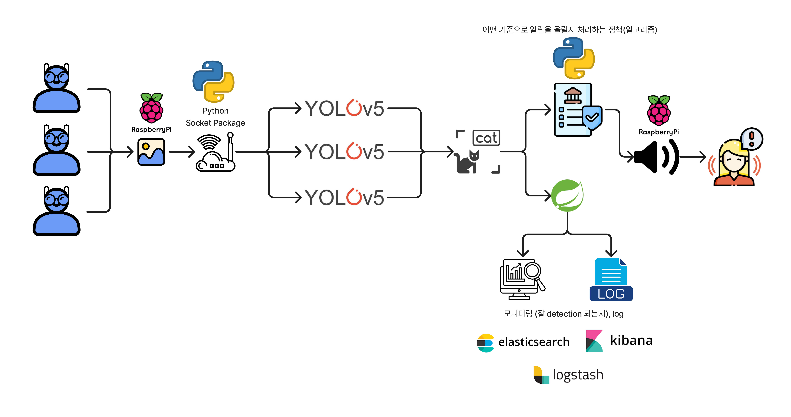
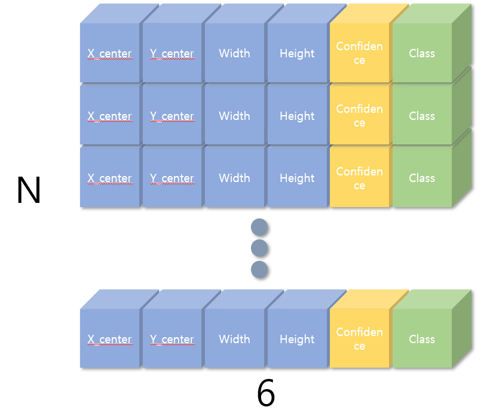

  

---
- 프로젝트 개념도
  
---
## 1. Computer Vision (Yolov5)
### 1-1. 실행 방법
1. 가상환경 생성

```bash
conda create -n yolov5 python=3.8
'''

2. 가상환경 실행

```bash
conda activate yolov5
```

3. 패키지 설치

```bash
cd yolov5
pip install -r requriements.txt
```

4. 모델 실행

```bash
python detect.py --weights stairv2_epoch100.pt --view-img --source "이미지 경로" 웹캠 사용원할때, 0
```

4. api로 실행
```bash
python detect_api.py
```
---
### 1-2. 구체적 사용 방법
실행은 크게 2가지 타입으로 가능.
1. bash에서 detect.py에 argument전달하여 모델을 바로 실행하기
2. detect_api.py에서 api함수에 전달하는 argument 전달해서 실행하기  
Computer Vision server에 api 날리기 위해서 **2번째** 방법을 사용해야함.

<**Argument 설명**>
```python
weights=ROOT / 'yolov5s.pt',  # 모델 가중치 경로
source=ROOT / 'data/images',  # 추론할 데이터 경로, 웹캠이라면 숫자 0
data=ROOT / 'data/coco128.yaml',  # 학습한 데이터 경로. 수정 안해도 문제 되지 않음. 
imgsz=(640, 640),  # 추론하는 영상 크기.
conf_thres=0.25,  # model의 confidence가 해당 값 미만이라면, 검출 x
iou_thres=0.45,  # NMS 기법에 필요한 IOU점수를 설정. 낮을 수록, bouding box크기 커짐
max_det=1000,  # 이미지당 최대 검출 가능한 객체 수
device='',  # 몇 번 GPU 사용할 지 설정. 입력안하면 CPU
view_img=False,  # 결과 출력
save_txt=False,  # 결과를 프레임당 txt로 저장
save_csv=False,  # 결과를 프레임당 csv로 저장
save_conf=False,  # save txt가 True일 때, model의 confidence도 함께 저장
save_crop=False,  # box를 저장한다는데, 잘 모르겠음. 테스트필요.
nosave=False,  # runs에 결과 영상이 저장되지 않음.
classes=None,  # 번호로 넘겨준 클래스 검출 x
agnostic_nms=False,  # 학습된적 없는 class라고 검출
augment=False,  # 증강 추론. 테스트 필요
visualize=False,  # feature 시각화. 테스트 필요
update=False,  # 모든 모델 업데이트. 테스트 필요
project=ROOT / 'runs/detect',  # 결과 저장할 폴더 경로
name='exp',  # 결과 폴더 이름
exist_ok=False,  # existing project/name ok, do not increment
line_thickness=3,  # bounding box 두께 (픽셀단위)
hide_labels=False,  # label 숨김
hide_conf=False,  # confidences 숨김
half=False,  # FP16 half-precision inference 사용. 계산량이 적어지는 장점있음
dnn=False,  # OpenCV DNN for ONNX inference사용. pytorch대신 opencv 사용
vid_stride=1,  # video frame-rate stride. 테스트 필요. 아마 프레임을 2개 뛰어넘는 것일듯?
```
실행 결과는 runs 폴더에 저장됨.
---
### 1-3. 모델 추론 결과

한 이미지당 검출된 객체에 대한 raw result가 나온다.   


Object Detection은 location prediction후에, 해당 location에 대한 classification이 이루어지므로, 검출된 객체라는 것은 모델이 객체가 있다고 예측한 location prediction이 이루어진 pixel 집합을 의미한다. 


  

```
# raw result
[tensor([[ 12.18872,  29.83224, 628.76373, 493.86209,   0.73080,   0.00000]])]
```

0~3 element들만 이후에 normalize하여, 아래와 같은 좌표에 관한 데이터가 나온다.

```
# normalized result
0 0.665625 0.570833 0.65625 0.808333 
```

normalized result에서 1~4 elements는 x_center, y_center, width, height이다.
  

- 실제 추론 영상  
[](https://youtu.be/8jdNFkHKAYk)

- 라즈베리파이 -> 로컬 노트북 YOLOv5  
[](https://youtu.be/FeTxiVqJM0Y)
